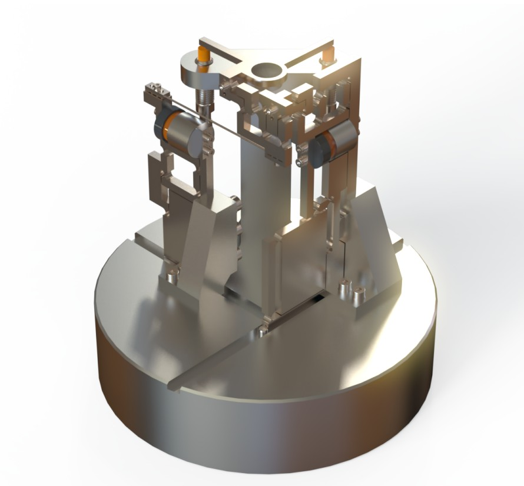

# High-Frequency 2-DOF Mirror Mechanism for Femtosecond Laser Micro-Machining

This repository contains MATLAB code and documentation from a semester project at EPFL (MICRO-201, Spring 2021). The project focused on the design, analysis, and dynamic balancing of a two-degree-of-freedom (2DOF) mirror mechanism used to steer a femtosecond laser beam in high-precision micro-machining applications.

## 🔍 Project Summary

The mechanism enables fast, precise redirection of a laser spot across a 2 mm circular scan area on a substrate. Using a 2DOF mirror suspended on flexible pivots, the design achieves high scanning frequencies (up to 1360 Hz) while maintaining low parasitic motion and high stiffness.

To reduce vibration transmission to the substrate and support frame, the system is dynamically balanced by symmetric counter-masses and optimized inertial design. The guiding structure is entirely flexure-based, enabling frictionless and backlash-free operation suitable for cleanroom environments.

The system operates in two orthogonal planes—XZ and YZ—which are dynamically and kinematically coupled. Figures 2 and 3 illustrate these two mechanical blocks, while Figure 4 shows the geometry of the ideal pivot point. A complete schematic of the mechanism and its linkages is provided in Figure 5.

## 🧠 Technical Highlights

- **Flexure Design**: All joints are monolithic flexure hinges designed to achieve 1.5° angular travel while keeping stress within fatigue limits.
- **Dynamic Balancing**: Angular accelerations up to 6126 rad/s² are achieved without exporting significant reaction forces to the base.
- **Low Parasitics**: Parasitic translations are maintained below 0.26 µm even under maximum deflection conditions.
- **High-Frequency Scanning**: The system supports up to 1360 Hz scanning frequency with a cycloidal motion profile and voice coil actuation.

## 📁 Relevant Files

| File | Purpose |
|------|---------|
| `block_YZ.m` | Computes inertia and center-of-mass displacement for the YZ mechanism |
| `block_XZ.m` | Computes inertia and center-of-mass displacement for the XZ mechanism |
| `parasitic_translation.m` | Simulates parasitic translation of the mirror due to flexure deformation and EDM fabrication tolerances |
| `utility_functions.m` | Contains shared helper functions for material properties, inertia, and mass calculations |

## 📁 Relevant Figures

Figure 9 shows the simulated parasitic translation on the substrate along the Z-axis, taking into account angular motion and machining tolerances. This result is computed in `parasitic_translation.m`.

Figures 11 and 12 illustrate the displacement of the system’s center of mass as a function of mirror angular deflection, which is minimized through iterative inertial balancing implemented in the code.

Figures 13 and 14 show the elastic potential energy stored in the system as a function of actuator displacement. This relates directly to the equivalent stiffness values computed in the code.

Table 1 summarizes the stress analysis results and safety factors for all critical flexural components in the mechanism.

## 📄 Report

The full methodology, mechanical design, analytical modeling, and performance validation are detailed in the project report `Rapport_de_CdM_II.pdf`.

## 👥 Team

- Yassir Belguerch  
- Naël Dillenbourg  
- Gilles Regamey  
- Mathieu Schertenleib  
- Sufyan Zakeeruddin

## 📜 License

This work is part of a university educational project and is shared for academic and reference purposes. Please acknowledge the original authors when referencing this work.
